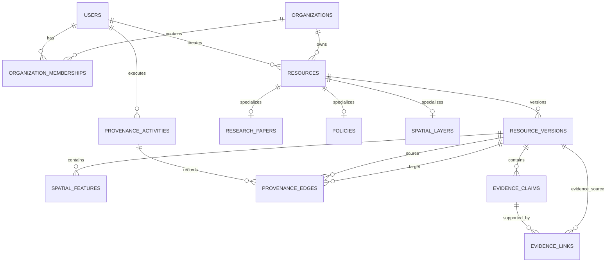
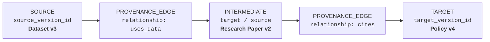

# Database Schema Design

## Entity-Relationship Overview



---

## Domain Entity Specifications

### 1. Identity & Organization Layer
* **`USERS`**: Platform accounts for citizens, surveyors, registrars, and policy researchers.
* **`ORGANIZATIONS`**: Land ministries, municipal cadastral offices, survey councils, and research institutions.
* **`ORGANIZATION_MEMBERSHIPS`**: Join entity managing user membership roles (Owner, Admin, Member, Contributor) within organizations.

### 2. Core Resource & Versioning Layer
* **`RESOURCES`**: Top-level identity for any governed asset (cadastral layer, research paper, statutory policy). Created by a User, owned by an Organization.
* **`RESOURCE_VERSIONS`**: **Append-only** snapshots capturing immutable state changes, checksums, and author signatures over time.

### 3. Resource Specializations
* **`RESEARCH_PAPERS`**: Land tenure studies, socio-economic impact assessments, and academic research.
* **`POLICIES`**: Statutory acts, customary land guidelines, regulatory valuation standards, and zoning bylaws.
* **`SPATIAL_LAYERS`**: Cadastral parcel maps, administrative boundaries, topographical surveys, and dispute overlay layers.

### 4. Cadastral & Spatial Geometry Layer
* **`SPATIAL_FEATURES`**: Individual land parcels, survey beacons, and boundary vectors in **EPSG:4326** with GiST indexes. Contained directly within specific `RESOURCE_VERSIONS`.

### 5. Provenance & W3C PROV-Aligned Audit Trail
* **`PROVENANCE_ACTIVITIES`**: Specific actions performed by users (e.g., `BOUNDARY_MUTATION`, `TITLE_TRANSFER`, `POLICY_RATIFICATION`).
* **`PROVENANCE_EDGES`**: Graph relationships linking prior resource versions (source) to generated resource versions (target) through a provenance activity.

### 6. Evidence & Verification Claims
* **`EVIDENCE_CLAIMS`**: Formal assertions made within a resource version (e.g., "Surveyor certification confirms no boundary encroachment").
* **`EVIDENCE_LINKS`**: Bidirectional links proving claims by referencing specific supporting `RESOURCE_VERSIONS` (e.g., deed scans, satellite imagery, signed affidavits).

---

## 7. Provenance Edge Semantics & Concrete Example

Directed provenance edges link immutable resource versions to capture origin, derivation, citations, and evidence backing.

### Table Schema: `PROVENANCE_EDGES`
* `id` (UUID, Primary Key)
* `activity_id` (UUID, Foreign Key ➔ `PROVENANCE_ACTIVITIES.id`, Nullable)
* `source_version_id` (UUID, Foreign Key ➔ `RESOURCE_VERSIONS.id`, Not Null, Index)
* `target_version_id` (UUID, Foreign Key ➔ `RESOURCE_VERSIONS.id`, Not Null, Index)
* `relationship` (VARCHAR(50), Not Null, Index)
* `metadata` (JSONB, Nullable — confidence score, transformation parameters, section locator)
* `created_at` (TIMESTAMPTZ, Default `NOW()`, Not Null)

### Concrete Examples

#### Edge 1: Research Paper analyzing a Dataset
```
source_version_id = Dataset v3
target_version_id = Research Paper v2
relationship      = "uses_data"
```

#### Edge 2: Statutory Policy citing a Research Paper
```
source_version_id = Research Paper v2
target_version_id = Policy v4
relationship      = "cites"
```

#### Chained Lineage:


### Standard Relationship Types

| Relationship | Source Version | Target Version | Description |
| :--- | :--- | :--- | :--- |
| `uses_data` | Dataset / Spatial Layer | Research Paper / Model | The target uses empirical data provided by the source. |
| `derived_from` | Raw Dataset / Base Boundary | Filtered Layer / Cadastral Subdivision | The target was created by transforming or subdividing the source. |
| `informs_policy` | Research Paper / Evidence | Statutory Policy | Empirical research that directly motivated or justified a policy. |
| `implements_policy` | Policy Act | Cadastral Zoning Layer / Rule | A spatial or administrative layer enforcing legal policy provisions. |
| `supercedes` | Previous Version (v1) | Next Version (v2) | Lineage sequence tracking direct version obsolescence. |

